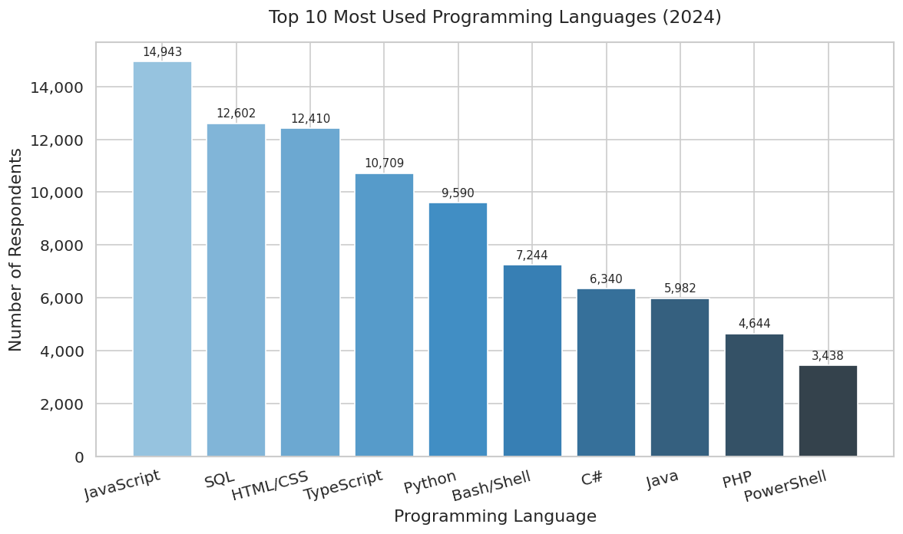

# Stack Overflow Developer Survey — 2024 Global Trends Analysis

**IBM Data Analyst Professional Certificate · Capstone Project**  
Hugo Apolinário · June 2025


---

## Table of contents
1. [About the project](#about-the-project)
2. [Dataset](#dataset)
3. [Methodology](#methodology)
4. [Key findings](#key-findings)
5. [Dashboard](#dashboard)
6. [How to run](#how-to-run)
7. [Technologies used](#technologies-used)
8. [License](#license)

---

## About the project

Every year, Stack Overflow surveys tens of thousands of developers worldwide 
to capture the state of the industry. This project analyses the **2024 edition** 
— covering 65,000+ responses — to uncover which programming languages, databases, 
and cloud platforms are dominant today, and which are gaining ground for tomorrow.

The goal is to produce actionable insights that can inform decisions around hiring 
strategy, technology investment, and learning paths for organisations and 
individual developers alike.

**Audience:** Tech leaders, HR managers, educators, and developers planning 
their next skill investment.

---

## Dataset

| Property | Detail |
|---|---|
| Source | Stack Overflow Annual Developer Survey 2024 |
| Responses | 65,000+ (global) |
| Collection method | Online self-reported survey |
| Licence | ODbL (Open Database Licence) |
| Link | [Stack Overflow Insights](https://insights.stackoverflow.com/survey) |

---

## Methodology

**Data wrangling (Python + Pandas):**
- Removed duplicate entries and handled missing values
- Normalised multi-response columns (e.g. a respondent listing 5 languages
  was expanded into separate rows for accurate counts)
- Split and aggregated text columns to enable "top 10" ranking analysis

**Visualisation:** Python (Matplotlib / Seaborn) for exploratory charts;  
Looker Studio for the interactive dashboards.

---

## Key findings

### 1. Programming languages

- **JavaScript, SQL, and HTML/CSS** remain the top 3 most-used languages globally.
- **Python and TypeScript** are growing fast — both appear in the top 5 of
  "languages to watch next year."
- **Go and Rust** are emerging as preferred choices among developers planning
  their next skill upgrade.

### 2. Databases
- **PostgreSQL** leads both current usage (11,514 respondents) and future demand
  (12,193 respondents) — the only database to top both charts.
- **Redis and MongoDB** have gone mainstream, reflecting a broader shift toward
  flexible, high-performance data platforms.
- **Supabase** is a notable new entrant in the "desired" list, signalling
  early adoption momentum.

### 3. Cloud platforms
- **AWS** is the dominant cloud platform, far ahead of Google Cloud and Azure.
- **React and Node.js** lead web framework usage across all experience levels.

### 4. Salary by language
- **Swift ($130,801), Python ($114,383), and C++ ($113,883)** command the
  highest average annual salaries.
- SQL ($84,793) and PHP ($84,727) sit at the lower end — reinforcing the value
  of pairing SQL with a higher-salary language like Python.

### 5. Demographics
- **41.3%** of respondents are aged 25–34.
- **Bachelor's degrees** are the most common qualification (8,629 respondents).
- The US dominates geographically, though the survey captures a global audience.

---

## Dashboard

Interactive dashboards were built in Looker Studio covering three themes:
- **Current technology usage** — top languages, platforms, and frameworks
  by experience level
- **Future technology trends** — desired databases, platforms, and frameworks
  for next year
- **Demographics** — respondent age groups, geographic distribution,
  and education levels

> Dashboard screenshots are available in the PDF presentation included
> in this repository.  
> A live Looker Studio link will be added once the dashboard is republished.

---

## How to run

1. Clone this repository
2. Open `stackoverflow_analysis.ipynb` in JupyterLab
3. Run all cells top to bottom with `Shift + Enter`

**Dependencies:**
```
pip install pandas matplotlib seaborn
```

---

## Technologies used

| Tool | Purpose |
|---|---|
| Python 3.10 | Data wrangling and EDA |
| Pandas | Data cleaning and transformation |
| Matplotlib / Seaborn | Exploratory visualisations |
| Looker Studio | Interactive dashboards |
| Jupyter Notebook | Analysis environment |

---

## License

This project is licensed under the **MIT License** — see [LICENSE](LICENSE)
for details.  
Dataset: Stack Overflow Annual Developer Survey 2024 — licensed under ODbL.
